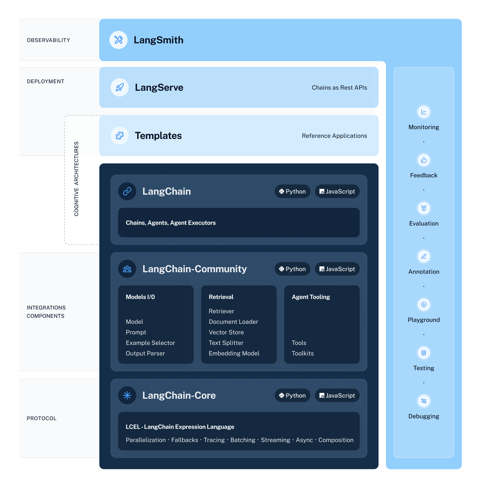

## [LangChain](https://www.langchain.com/)
- A framework for developing GenAI apps
    - Uses `LangSmith` for **LLMOps** (Debugging, Evaluation, Monitoring etc.)
    - Uses `LangServe` to create Chains as Rest APIs for depolyment

